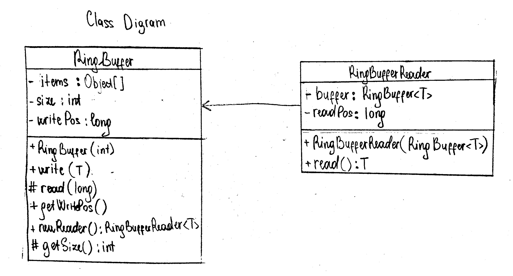
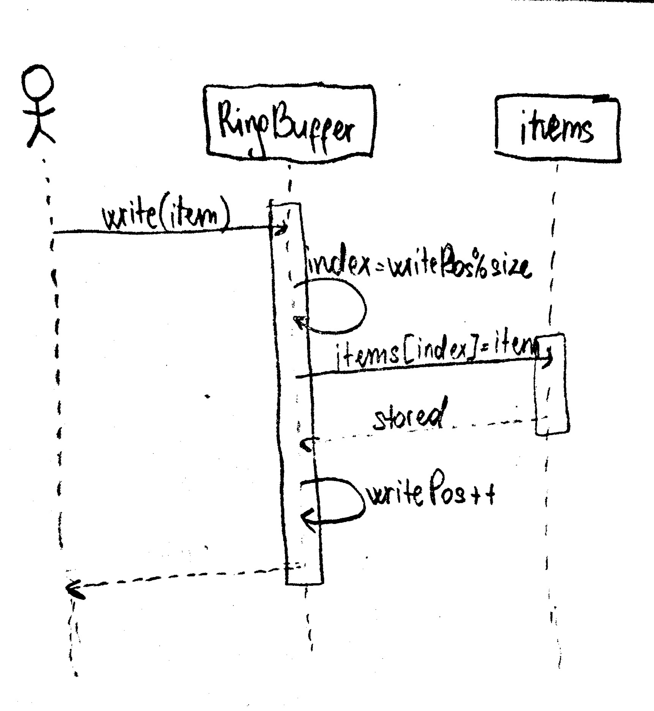
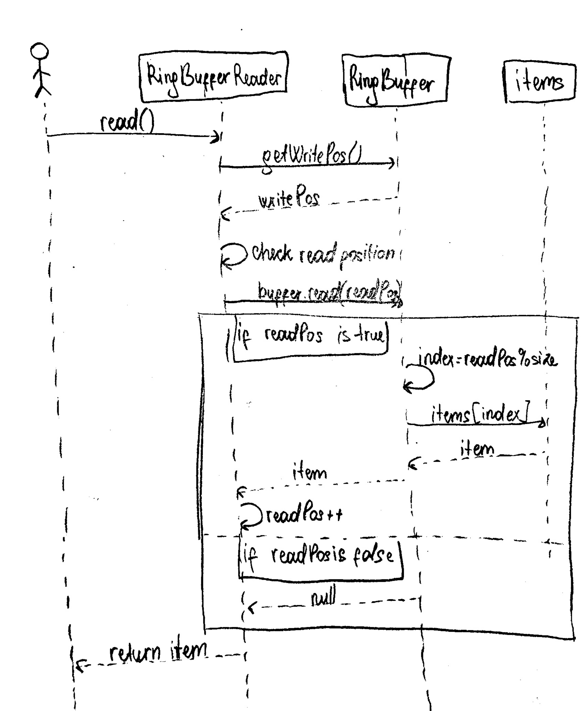

# Ring Buffer (Multiple Readers, Single Writer)

## Project Overview

The following project implements a generic Ring Buffer in Java that includes:
- Single writer
- Multiple readers that are independent of each other
- Custom capacvity for the buffer
- Overwriting of oldest data when the buffer is full

## Design Explanation

### RingBuffer<T>

The RingBuffer class handles the core buffer functionality:
- Stores elements in a fixed-size array
- Tracks the global write position
- Overwrites the oldest data when capacity is exceeded
- Creates new readers for accessing the buffer

Only a single writer is allowed to call the write() method

### RingBufferReader<T>

The RingBufferReader class manages individual reader behavior:
- Maintains its own read position
- Reads elements indepenbdently without affecting other readers
- Autlomatically skips data that has been overwritten if it falls behiind

Reading from the buffer does not remove elements for other readers


## UML Class Diagram



## UML Sequence Diagram – write()



## UML Sequence Diagram – read()




## How to Run

1. Clone the repository:
   ```bash
   git clone https://github.com/Leyla335/Object-Oriented-Analysis-and-Design-Assignment.git

2. Open a terminal and navfigate to the project root(probably the following):
   ```bash
   cd Object-Oriented-Analysis-and-Design-Assignment

3. Compile the Main file:
    ```bash
    javac Assignment_2/Main.java

4. Runt the program:
    ```bash
    java Assignment_2.Main